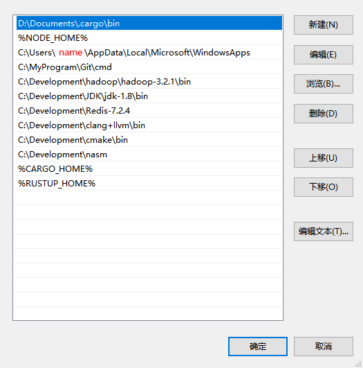
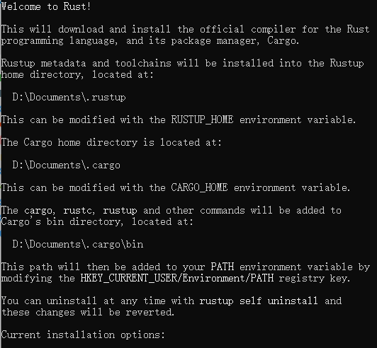

## 01.常用命令
```sh
# 卸载 stable-x86_64-pc-windows-msvc
rustup uninstall toolchain stable-x86_64-pc-windows-msvc

# 安装 stable-x86_64-pc-windows-gnu
rustup toolchain install stable-x86_64-pc-windows-gnu

# 设置 stable-x86_64-pc-windows-gnu 为默认环境（不推荐会出现编译失败的问题）
rustup default stable-x86_64-pc-windows-gnu

# 安装 Windows msvc 版本工具链条,推荐
rustup toolchain install stable-msvc
rustup default stable-msvc
rustup uninstall stable-msvc

# 安装 Windows gnu 版本工具链条
rustup toolchain install stable-gnu
rustup default stable-gnu
rustup uninstall stable-gnu

# Linux 安装 工具链
rustup toolchain install stable
# 安装 nightly
rustup toolchain install nightly

# 查看信息
rustup show

# 更新
rustup update

# 卸载
rustup self uninstall
```

## 1 RsProxy 加速服务

[A high speed crates.io mirror](https://rsproxy.cn/)

## 2 使用环境变量指定安装位置(Windows)
安装的 `rust` 主要有两个文件夹(`.cargo` 和 `.rustup`)，而且会默认生成到 C 盘下。 但是，我们通过修改环境变量可以自定义安装路径

### 2.1 创建环境变量
```sh
CARGO_HOME="D:\Documents\.cargo"
RUSTUP_HOME="D:\Documents\.rustup"
```

### 2.2 添加到 path 路径下


> **该操作需要在安装 rust 之前完成**

### 2.3 确认配置生效
运行 rust 安装程序，确实上面的配置已经生效




## 3 提升 cargo 编译速度
rustflags 是一个环境变量，用于传递自定义标志给 Cargo 的 rustc 编译器。通过设置 rustflags，你可以影响编译过程中的一些行为。

```toml
[build]
target-dir = "D:\\Documents\\.cargo\\target"
rustflags = ["-Ctarget-cpu=native"]

[target.x86_64-pc-windows-msvc]
rustflags = ["-Ctarget-feature=+crt-static"]
```

## 4 sccache
[Shared Compilation Cache](https://github.com/mozilla/sccache)

SCCache 是一个类似 ccache 的编译器缓存工具。它用作编译器包装器，并尽可能避免编译，将缓存的结果存储在本地磁盘或多个云存储后端之一中。
```sh
cargo install sccache
```

### 4.1 修改 sccache bin

通过 `Cargo.toml` 配置文件修改 rustc-wrapper

```toml
[build]
rustc-wrapper = "D:\\Documents\\.cargo\\bin\\sccache"
```

### 4.2 修改 Cache location
通过环境变量修改 Cache location

```sh
# linux
export SCCACHE_DIR=/my/new/cache/location

# windows 通过用户环境变量设置 SCCACHE_DIR
set SCCACHE_DIR=C:\my\new\cache\location

# 重启服务
sccache --stop-server
sccache --start-server

# 查看当前状态，确认配置已经生效
sccache --show-stats
sccache -s
```

### 4.3 修改 Cache Size
```sh
# linux
export SCCACHE_CACHE_SIZE="20G"

# windows 通过用户环境变量设置 SCCACHE_CACHE_SIZE
set SCCACHE_CACHE_SIZE="20G"

# 重启服务
```

## 5 C++ 开发环境配置

### 5.1 安装 CMake
https://cmake.org/download/
```sh
C:\Develop\cmake\bin
```
### 5.2 安装 llvm + clang
https://github.com/llvm/llvm-project/releases
```sh
C:\Develop\clang+llvm\bin
```

### 5.3 安装 NASM
https://www.nasm.us/
```sh
C:\Develop\nasm
```

### 6 Windows MSYS 配置

将 `C:\Program Files\Git\usr\bin` 添加到环境变量，Git for Windows 在其 `usr\bin` 目录中包含了许多 Unix/Linux 风格的工具和实用程序

## 06.ArchLinux 安装

```
This will download and install the official compiler for the Rust
programming language, and its package manager, Cargo.

Rustup metadata and toolchains will be installed into the Rustup
home directory, located at:

 /home/ngt/.rustup

This can be modified with the RUSTUP_HOME environment variable.

The Cargo home directory is located at:

 /home/ngt/.cargo

This can be modified with the CARGO_HOME environment variable.

The cargo, rustc, rustup and other commands will be added to
Cargo's bin directory, located at:

 /home/ngt/.cargo/bin

This path will then be added to your PATH environment variable by
modifying the profile files located at:

 /home/ngt/.profile
 /home/ngt/.bash_profile
 /home/ngt/.bashrc
 /home/ngt/.zshenv
 /home/ngt/.config/fish/conf.d/rustup.fish

You can uninstall at any time with rustup self uninstall and
these changes will be reverted.

Current installation options:


  default host triple: x86_64-unknown-linux-gnu
    default toolchain: stable (default)
              profile: default
 modify PATH variable: yes
```
## 07.完整 cargo config

### 7.1 Windows
```toml
[source.crates-io]
replace-with = 'rsproxy-sparse'
[source.rsproxy]
registry = "https://rsproxy.cn/crates.io-index"
[source.rsproxy-sparse]
registry = "sparse+https://rsproxy.cn/index/"
[registries.rsproxy]
index = "https://rsproxy.cn/crates.io-index"

[net]
git-fetch-with-cli = true

[build]
target-dir = "D:\\Documents\\.cargo\\target"
rustflags = ["-Ctarget-cpu=native"]
rustc-wrapper = "D:\\Documents\\.cargo\\bin\\sccache"

[target.x86_64-pc-windows-msvc]
rustflags = ["-Ctarget-feature=+crt-static"]
```


### 7.3 Linux
```toml
[source.crates-io]
replace-with = 'rsproxy-sparse'
[source.rsproxy]
registry = "https://rsproxy.cn/crates.io-index"
[source.rsproxy-sparse]
registry = "sparse+https://rsproxy.cn/index/"
[registries.rsproxy]
index = "https://rsproxy.cn/crates.io-index"

[net]
git-fetch-with-cli = true

[build]
target-dir = "/home/ngt/.cargo/target"
rustc-wrapper = "/home/ngt/.cargo/bin/sccache"
rustflags = ["-Ctarget-cpu=native"]
```
