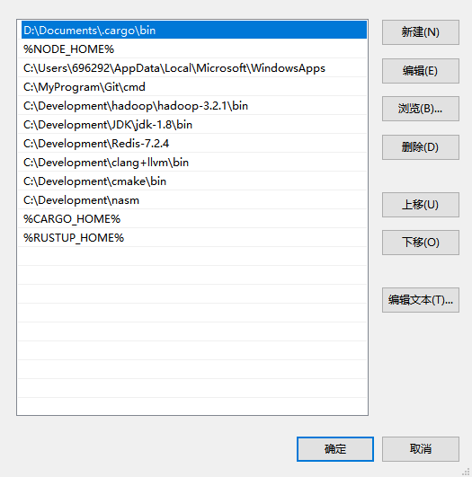
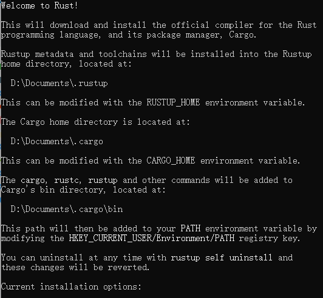

## 0 常用命令
```sh
# 卸载 stable-x86_64-pc-windows-msvc
rustup uninstall toolchain stable-x86_64-pc-windows-msvc

# 安装 stable-x86_64-pc-windows-gnu
rustup toolchain install stable-x86_64-pc-windows-gnu

# 设置 stable-x86_64-pc-windows-gnu 为默认环境（不推荐会出现编译失败的问题）
rustup default stable-x86_64-pc-windows-gnu

# 安装
rustup toolchain install stable-msvc
rustup default stable-msvc
rustup uninstall stable-msvc

rustup toolchain install stable-gnu
rustup default stable-gnu
rustup uninstall stable-gnu

# 查看信息
rustup show

# 更新
rustup update

# 卸载
rustup self uninstall
```

## 1 RsProxy 加速服务

[A high speed crates.io mirror](https://rsproxy.cn/)

## 2 使用环境变量指定安装位置
安装的 `rust` 主要有两个文件夹(`.cargo` 和 `.rustup`)，而且会默认生成到 C 盘下。 但是，我们通过修改环境变量可以自定义安装路径

### 2.1 创建环境变量
```sh
CARGO_HOME="D:\Documents\.cargo"
RUSTUP_HOME="D:\Documents\.rustup"
```

### 2.2 添加到 path 路径下


> **该操作需要在安装 rust 之前完成**

### 2.3 确认配置生效
运行 rust 安装程序，确实上面的配置已经生效




## 3 提升 cargo 编译速度
rustflags 是一个环境变量，用于传递自定义标志给 Cargo 的 rustc 编译器。通过设置 rustflags，你可以影响编译过程中的一些行为。

```toml
[build]
target-dir = "D:\\Documents\\.cargo\\target"
rustflags = ["-Ctarget-cpu=native"]

[target.x86_64-pc-windows-msvc]
rustflags = ["-Ctarget-feature=+crt-static"]
```

## 4 sccache
[Shared Compilation Cache](https://github.com/mozilla/sccache)

SCCache 是一个类似 ccache 的编译器缓存工具。它用作编译器包装器，并尽可能避免编译，将缓存的结果存储在本地磁盘或多个云存储后端之一中。
```sh
cargo install sccache
```

### 4.1 修改 sccache bin

通过 `Cargo.toml` 配置文件修改 rustc-wrapper

```toml
[build]
rustc-wrapper = "D:\\Documents\\.cargo\\bin\\sccache"
```

### 4.2 修改 Cache location
通过环境变量修改 Cache location

```sh
# linux
export SCCACHE_DIR=/my/new/cache/location

# windows 通过用户环境变量设置 SCCACHE_DIR
set SCCACHE_DIR=C:\my\new\cache\location

# 重启服务
sccache --stop-server
sccache --start-server

# 查看当前状态，确认配置已经生效
sccache --show-stats
sccache -s
```

### 4.3 修改 Cache Size
```sh
# linux
export SCCACHE_CACHE_SIZE="20G"

# windows 通过用户环境变量设置 SCCACHE_CACHE_SIZE
set SCCACHE_CACHE_SIZE="20G"

# 重启服务
```

## 5 C++ 开发环境配置

### 5.1 安装 CMake
https://cmake.org/download/
```sh
C:\Develop\cmake\bin
```
### 5.2 安装 llvm + clang
https://github.com/llvm/llvm-project/releases
```sh
C:\Develop\clang+llvm\bin
```

### 5.3 安装 NASM
https://www.nasm.us/
```sh
C:\Develop\nasm
```

## 完整 cargo config

```toml
[source.crates-io]
replace-with = 'rsproxy-sparse'
[source.rsproxy]
registry = "https://rsproxy.cn/crates.io-index"
[source.rsproxy-sparse]
registry = "sparse+https://rsproxy.cn/index/"
[registries.rsproxy]
index = "https://rsproxy.cn/crates.io-index"

[net]
git-fetch-with-cli = true

[build]
target-dir = "D:\\Documents\\.cargo\\target"
rustflags = ["-Ctarget-cpu=native"]
rustc-wrapper = "D:\\Documents\\.cargo\\bin\\sccache"

[target.x86_64-pc-windows-msvc]
rustflags = ["-Ctarget-feature=+crt-static"]
```
